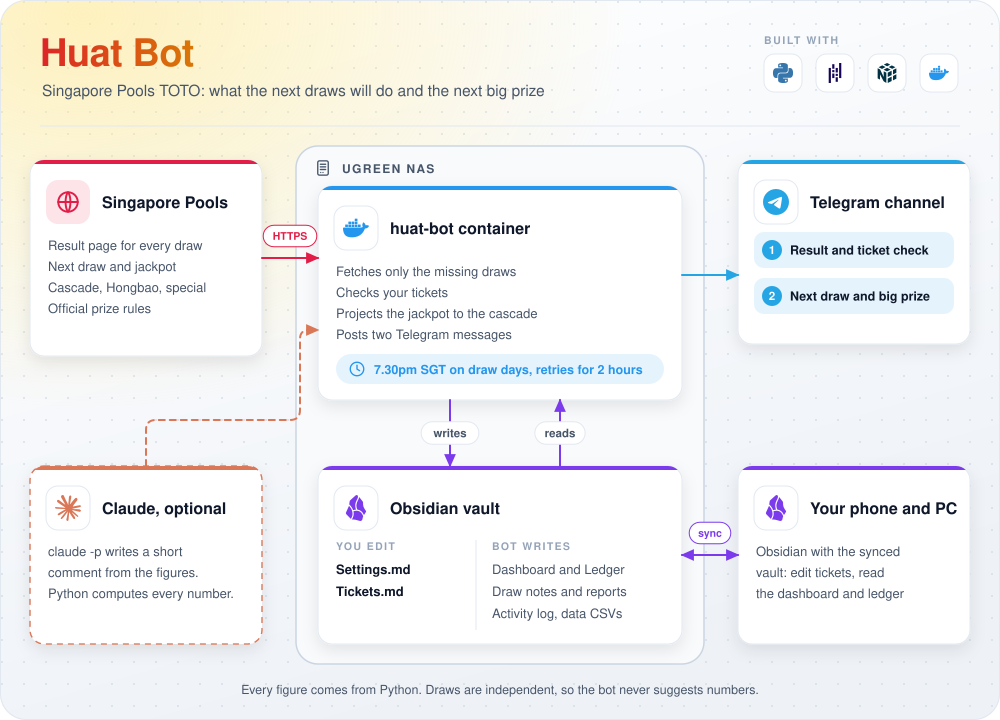
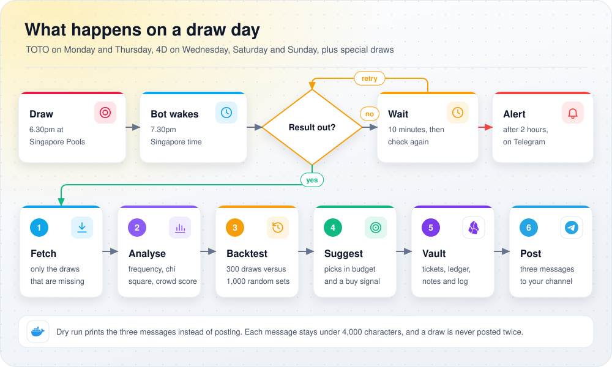

<div align="center">

# Huat Bot

**Singapore Pools 4D and TOTO analyst that lives on your NAS**

[](https://www.python.org)
[](docker-compose.yml)
[](#telegram-bot-and-channel)
[](#the-vault)
[](docs/diagrams)
[](https://github.com/gcjk768/Huat-Bot/actions/workflows/ci.yml)

</div>

It fetches every result, analyses the history, suggests numbers that fit your budget, checks your
tickets, posts three short messages to your Telegram channel on draw days, and keeps everything it
reads and writes inside your Obsidian vault.

<p align="center">
  <picture>
    <source media="(prefers-color-scheme: dark)" srcset="docs/diagrams/architecture-dark.svg">
    
  </picture>
</p>

<p align="center"><sub>Made with draw.io. Edit the source:
<a href="https://app.diagrams.net/#Uhttps%3A%2F%2Fraw.githubusercontent.com%2Fgcjk768%2FHuat-Bot%2Fmain%2Fdocs%2Fdiagrams%2Farchitecture.drawio">architecture</a> ·
<a href="https://app.diagrams.net/#Uhttps%3A%2F%2Fraw.githubusercontent.com%2Fgcjk768%2FHuat-Bot%2Fmain%2Fdocs%2Fdiagrams%2Fdraw-day.drawio">draw day</a> ·
<a href="docs/diagrams">how to regenerate</a></sub></p>

> [!NOTE]
> Every figure comes from Python code. If you switch on the optional commentary, Claude only writes a
> short comment about figures the code already computed. Every draw is independent, so nothing here
> changes your odds of winning; the bot helps you spend within a budget and avoid sharing prizes.

## Contents

* [What it does](#what-it-does)
* [The honest odds note](#the-honest-odds-note)
* [Quick start](#quick-start)
* [UGREEN NAS setup, step by step](#ugreen-nas-setup-step-by-step)
* [Telegram bot and channel](#telegram-bot-and-channel)
* [First run, in this order](#first-run-in-this-order)
* [The vault](#the-vault)
* [Schedule and retries](#schedule-and-retries)
* [Commands](#commands)
* [Settings](#settings)
* [How the numbers are worked out](#how-the-numbers-are-worked-out)
* [Optional Claude commentary](#optional-claude-commentary)
* [Troubleshooting](#troubleshooting)
* [Updating](#updating)
* [Development](#development)

## What it does

| Step | What happens |
| --- | --- |
| Fetch | Downloads only the draws that are missing: TOTO from draw 2995 (9 Oct 2014, the first draw of the current 6 from 49 format) and the latest 1,000 4D draws. At most 4 requests at a time, with a pause, slowing down if the site complains. Checks that each page is the draw it asked for and that the newest stored draw matches the latest one on the site. |
| Prize rules | Reads the official TOTO and 4D prize structure pages and says plainly whether the prize percentages were confirmed or the built in values were used. |
| Analyse TOTO | Frequency (all time, last 100, last 50), overdue numbers, common pairs, the usual shape of a winning set, a chi square fairness test and a crowd score for each number. |
| Analyse 4D | Digit frequency per position, numbers that won more than once, common digit sets, a chi square test, and the average return per $1 for Big, Small and iBet. |
| Backtest | Replays the last 300 draws: each strategy only sees the draws before it, and is scored with the prize amounts really paid, against 1,000 random players. |
| Suggest | One TOTO set per strategy (Hot, Overdue, Balanced, Low Crowd), an optional System 7, and five 4D numbers with a bet type and stake. The total never goes above your budget. |
| Buy signal | Estimated return per $1 for the next TOTO draw at its jackpot, labelled HIGH, MEDIUM or LOW. |
| Tickets | Reads your tickets from `Tickets.md`, checks each one once its result is out, and keeps a ledger with total spent, won and net. |
| Vault | Writes a dashboard, the ledger, a note per draw, suggestion notes, a full report per run and an activity log, all in your Obsidian vault. |
| Telegram | Posts three messages: 1) latest results and your ticket check, 2) next draws, jackpot and buy signal, 3) suggested numbers and cost. Each stays under 4,000 characters. A draw is never posted twice. |

## The honest odds note

> Every draw is independent, so past results do not change the odds. TOTO Group 1 is 1 in
> 13,983,816 per board, and any TOTO prize is about 1 in 54. A 4D Big bet wins some prize 23 times
> in 10,000. TOTO pays about 54% of sales back as prizes and a 4D Big bet returns about $0.66 per $1
> on average, so no number or strategy beats the odds.

The bot says this in every report. Hot, overdue and balanced picks are for fun. The only thing a
strategy can change is how many people you share a prize with, which is what the crowd score is
about. The backtest tells you, draw by draw, whether any strategy did better than random players. It
almost never does, and the bot says so. Never spend above your budget.

## Quick start

Any machine with Docker and Docker Compose:

```bash
git clone https://github.com/gcjk768/Huat-Bot.git
cd Huat-Bot
cp .env.example .env          # then fill in .env (see below)
docker compose build
docker compose run --rm huat-bot python -m huatbot check-site
docker compose run --rm huat-bot python -m huatbot demo
docker compose run --rm huat-bot python -m huatbot run --dry-run
docker compose up -d          # starts the scheduler (serve)
docker compose logs -f
```

Without Docker (Python 3.11 or newer):

```bash
pip install -r requirements.txt
python -m huatbot demo                    # writes ./demo-vault, open it as a vault in Obsidian to look around
VAULT_PATH=/path/to/MyVault python -m huatbot run --dry-run
```

Only docker compose reads `.env`. Outside Docker, export its values into the shell first, or the
run has no Telegram token and turns into a dry run (it warns about this):

```bash
set -a; . ./.env; set +a                  # export every line of .env
VAULT_PATH=/path/to/MyVault python -m huatbot run
```

## UGREEN NAS setup, step by step

These steps use UGOS Pro. Menu names can differ a little between UGOS versions.

### 1. Turn on SSH and find your PUID and PGID

The container runs as your own NAS user, so everything it writes into the vault belongs to you.

1. In UGOS, open **Control Panel**, then **Terminal**, and turn on **SSH**.
2. From a PC, connect: `ssh yourname@your-nas-ip`
3. Run `id`. You will see something like:

   ```text
   uid=1000(yourname) gid=10(admin) groups=10(admin),100(users)
   ```

4. Put the numbers in `.env`: `PUID=1000` (the uid) and `PGID=10` (the gid).

You can turn SSH off again afterwards if you set up the bot through the Docker app.

### 2. Choose the vault folder

Huat Bot works inside an Obsidian vault on the NAS, for example a shared folder `Obsidian` with a vault
called `MyVault`. On UGOS the full path then looks like:

```text
/volume1/Obsidian/MyVault
```

To find the real path, open **File Manager**, right click the vault folder and choose **Properties**
(or run `ls /volume1` over SSH). Make sure the folder already exists: if Docker has to create it, it
belongs to root and the bot cannot write there.

Put the path in `.env` as `VAULT_HOST_PATH`. The bot keeps everything in one folder inside the vault
(`VAULT_FOLDER`, default `Huat Bot`) and never touches `.obsidian` or your other notes.

Your NAS user (the PUID above) needs **read and write** permission on that shared folder. In
**Control Panel**, open **Shared Folder** (or the folder's **Properties** in File Manager) and give
your user read and write access.

### 3. Make sure the vault is synced to your devices

The bot writes plain Markdown and CSV files into the NAS folder. To read them in Obsidian on your phone
and PC, that folder has to sync to your devices. Pick one:

| Option | Works on | Notes |
| --- | --- | --- |
| Syncthing | Windows, Mac, Linux, Android | Run Syncthing on the NAS (as a Docker container) and on each device, and share the vault folder. The most reliable two way sync for a NAS. |
| WebDAV with the Remotely Save plugin | All, including iPhone and iPad | Turn on WebDAV in UGOS file services, then point the Remotely Save community plugin in Obsidian at the vault folder. |
| UGREEN sync on a PC | Windows, Mac | Two way folder sync with the UGREEN NAS desktop app, then open the synced folder as a vault. |
| Open the share directly | Windows, Mac | Map the shared folder over SMB and open it as a vault. Simple, but only while the PC is on the home network. |
| Obsidian Sync | All | Only works if an Obsidian app keeps the NAS folder open and running (for example a PC that opens the SMB share and stays on). The bot itself cannot push to Obsidian Sync. |

Obsidian picks up files changed by the bot on its own. The bot writes every file in one go (a
temporary file, then a rename) and skips files whose content did not change, so sync tools never see
half written notes or needless changes.

### 4. Put the project on the NAS

Pick a folder for Docker projects, for example `/volume1/docker/huat-bot`, and put this repository there:

* over SSH: `git clone https://github.com/gcjk768/Huat-Bot.git /volume1/docker/huat-bot`
* or download the ZIP from GitHub, unzip it on your PC, and upload the folder with File Manager.

### 5. Create the .env file

Copy `.env.example` to `.env` in the same folder and fill it in. At least:

| Variable | Example |
| --- | --- |
| `TELEGRAM_BOT_TOKEN` | from BotFather (next section) |
| `TELEGRAM_CHAT_ID` | `@yourchannel` or the numeric id of a private channel |
| `VAULT_HOST_PATH` | `/volume1/Obsidian/MyVault` |
| `PUID`, `PGID` | from the `id` command |

If you want to see the messages in the log before anything is posted, set `DRY_RUN=1` for the first
few days, then set it back to `0` and run `docker compose up -d` (or redeploy the project in the UGOS
Docker app). A plain restart (`docker compose restart`, `docker restart` or the Restart button in the
Docker app) keeps the old values, because `.env` is only read when the container is created. All
variables are listed under [Settings](#settings).

### 6a. Start it with the UGOS Docker app

1. Open the **Docker** app and go to **Project**.
2. Click **Create**. Give it a name (`huat-bot`) and choose the folder from step 4 as the storage path.
3. UGOS finds `docker-compose.yml` in that folder. Use it as it is (if you are asked to paste the
   compose file instead, paste the content of `docker-compose.yml`).
4. Click **Deploy** (or **Build and run**). The first build downloads Python packages and takes a few
   minutes. If your UGOS version cannot build images inside a project, use the SSH route (6b) once to
   build, then manage the running container from the Docker app.
5. The project starts the `huat-bot` container, which runs the scheduler. To run one off commands
   (see [First run](#first-run-in-this-order)), open **Container**, select `huat-bot`, open its
   **Terminal**, and type for example `python -m huatbot check-site`.

### 6b. Or start it over SSH

```bash
cd /volume1/docker/huat-bot
sudo docker compose build
sudo docker compose run --rm huat-bot python -m huatbot check-site
sudo docker compose up -d
sudo docker compose logs -f
```

### 7. Network access

The NAS needs outbound HTTPS (port 443) to:

| Host | Why |
| --- | --- |
| `www.singaporepools.com.sg` | results, draw lists, next draw and jackpot pages |
| `online2.singaporepools.com` | official TOTO and 4D prize structure pages |
| `api.telegram.org` | posting the messages |
| `api.anthropic.com` | only if you turn on the Claude commentary |

If a firewall, an ad blocking DNS filter or a VPN on the NAS blocks any of these, `check-site`
shows which one fails.

## Telegram bot and channel

1. In Telegram, open a chat with **@BotFather** and send `/newbot`. Pick a display name and a username
   ending in `bot`. BotFather replies with the token, which looks like `123456789:AAH...`. Put it in
   `.env` as `TELEGRAM_BOT_TOKEN` and keep it secret.
2. Create a channel (New Channel). Public or private both work.
3. Open the channel info, **Administrators**, **Add Admin**, search for your bot's username and add it
   with permission to **post messages**. A bot can only post in a channel where it is an admin.
4. Find the chat id:
   * Public channel: use its username, for example `TELEGRAM_CHAT_ID=@huatbotchannel`.
   * Private channel: post any message in the channel, then open
     `https://api.telegram.org/bot<TOKEN>/getUpdates` in a browser (with your token). Look for
     `"channel_post"` and the `"chat"` inside it. The `"id"` there is the chat id. For a channel it
     starts with `-100`, for example `-1001234567890`. Copy all of it, including the minus sign.
     If the list is empty, post another message in the channel and reload.
5. Run `python -m huatbot run --dry-run` first to see the messages, then a real run to check that they
   arrive.

A group chat works the same way (add the bot to the group, the id comes from `"message"` instead of
`"channel_post"`).

## First run, in this order

Run these once before leaving the bot to its schedule. With the Docker app, type the
`python -m huatbot ...` part in the container terminal. Over SSH, put
`docker compose run --rm huat-bot` in front.

| Order | Command | What it does |
| --- | --- | --- |
| 1 | `python -m huatbot check-site` | Reads every Singapore Pools page the bot uses (draw lists, the latest TOTO and 4D result, next draw pages, draw type lists, prize pages) and prints a PASS or FAIL line for each. Nothing is saved. |
| 2 | `python -m huatbot demo` | Runs the whole pipeline on synthetic draws, with no network, and prints the three messages. Nothing is posted. It writes to a separate demo vault, never to your real one. In Docker that demo vault lives inside the container and is thrown away afterwards. |
| 3 | `python -m huatbot run --dry-run` | A real run: fills the vault, downloads the full history, writes the notes and the report, and prints the three messages instead of posting them. The first download is over 2,000 result pages, so give it about 15 to 30 minutes. Later runs only fetch the new draws. |
| 4 | `python -m huatbot serve` | The scheduler. This is what the container runs by default, so `docker compose up -d` (or the Docker app project) starts it. |

After step 3, open the vault in Obsidian and look at `Huat Bot/Dashboard.md`. Edit
`Huat Bot/Settings.md` to set your budgets, and add your tickets to `Huat Bot/Tickets.md`.

## The vault

Everything lives in one folder inside your vault (`VAULT_FOLDER`, default `Huat Bot`):

```text
MyVault/
├── .obsidian/                          never touched
├── (your own notes)                    never touched
└── Huat Bot/
    ├── Settings.md                     you edit: budgets and options as note properties
    ├── Tickets.md                      you edit: one ticket per table row
    ├── Dashboard.md                    next draws, buy signal, latest results, plan, totals
    ├── Ledger.md                       every ticket, what it won, totals, unreadable lines
    ├── Draws/
    │   ├── TOTO/2026-10-01 TOTO 4123.md
    │   └── 4D/2026-09-30 4D 5432.md
    ├── Suggestions/
    │   ├── 2026-10-05 TOTO 4124.md
    │   └── 2026-10-03 4D 5433.md
    ├── Reports/2026-10-02 1930 Report.md
    ├── Logs/2026-10 Activity.md        a row for every fetch, new draw, ticket check, note, post and error
    └── Data/
        ├── toto.csv
        ├── fourd.csv
        ├── ledger.csv
        ├── state.json                  next draw dates and what was already posted
        ├── prize_rules.json            prize rules cache (checked again after 7 days)
        └── backtest_cache.json         backtest results, reused until a new draw or a settings change
```

| You edit | The bot writes |
| --- | --- |
| `Settings.md`: the properties at the top of the note (see [Settings](#settings)). Read at the start of every run. | `Dashboard.md`, `Ledger.md`, draw notes, suggestion notes, reports and the activity log. They are rewritten by the bot, so do not edit them (your changes would be replaced). |
| `Tickets.md`: one row per ticket in the table. | `Data/*.csv` and the JSON files. You can open the CSVs in a spreadsheet, but keep the bot stopped while you edit them. |

`Settings.md` and `Tickets.md` are created with defaults and examples on the first run (or with
`init-vault`), and the bot never overwrites them after that.

A ticket row looks like this (copy the examples at the bottom of `Tickets.md`):

| Game | Draw date | Numbers | Bet type | Cost |
| --- | --- | --- | --- | --- |
| TOTO | 5 Oct 2026 | 3 11 19 27 38 45 | Ordinary | $1 |
| TOTO | 5 Oct 2026 | 3 11 19 27 38 45 49 | System 7 | $7 |
| 4D | 4 Oct 2026 | 0042 | Big | $2 |
| 4D | 4 Oct 2026 | 1234 | iBet Big | $1 |

Dates can be written `5 Oct 2026`, `Mon 5 Oct 2026` or `5/10/2026` (day first). TOTO bet types are
Ordinary and System 7 to System 12; 4D bet types are Big, Small, iBet Big and iBet Small. A row the bot
cannot read is listed in `Ledger.md` with the reason. A checked ticket stays in the ledger even if you
delete its row later.

## Schedule and retries

<p align="center">
  <picture>
    <source media="(prefers-color-scheme: dark)" srcset="docs/diagrams/draw-day-dark.svg">
    
  </picture>
</p>

| When | What happens |
| --- | --- |
| Draw days | TOTO on Monday and Thursday, 4D on Wednesday, Saturday and Sunday, all at 6.30pm Singapore time. Special draws on other days are picked up from the next draw pages and kept in `Data/state.json`. |
| Run time | 7.30pm Singapore time on a draw day (`RUN_AT`). |
| Retries | If the new result is not on the site yet, the bot checks again every 10 minutes (`RETRY_MINUTES`) for up to 2 hours (`RETRY_HOURS`). |
| Gave up | If a result is still missing after that, the bot posts a short notice and logs it. The next run picks the draw up. |
| No draw today | Nothing is posted; the activity log gets a row. |
| Restart | If the container starts inside the retry window (say the NAS rebooted at 8pm on a draw day), it runs straight away instead of waiting for the next day. |
| No double posts | `Data/state.json` remembers the newest draw posted for each game, so the scheduler never posts the same draw twice, even after a restart. If only some of the three messages went out (Telegram failed half way), the next run sends just the missing ones. A manual `run` posts again on purpose. |

The schedule always uses Singapore time, whatever the NAS time zone is.

## Commands

All commands are `python -m huatbot <command> [options]`. Each one exits with 0 when it worked and 1
when it did not. `python -m huatbot --help` lists them and `python -m huatbot --version` shows the
version.

| Command | What it does |
| --- | --- |
| `run` | One full run now: fetch new draws, analyse, backtest, suggest, check tickets, write the vault and post the three messages. A manual run posts even if the newest draw was posted before. |
| `serve` | The scheduler and the container's default command: runs at `RUN_AT` on draw days and retries until the results are out. It only posts draws that were not posted yet. |
| `fetch` | Only update the CSV files and the next draw information. No analysis, notes or posting. |
| `report` | Print the full report from the stored data. Nothing is fetched, posted or written to the notes. |
| `check-site` | Read every Singapore Pools page the bot uses and print a PASS or FAIL line for each. Saves nothing. |
| `demo` | The whole pipeline on synthetic data in a separate demo vault (`./demo-vault` unless you pass `--vault`). No network, never posts. |
| `init-vault` | Create the bot folder with `Settings.md` and `Tickets.md` in the vault, then stop. |

Every command accepts these options (after the command name):

| Option | Meaning |
| --- | --- |
| `--game toto`, `--game 4d`, `--game both` | Which game to fetch and report. Default both. |
| `--dry-run` | Print the Telegram messages instead of posting them. `DRY_RUN=1` does the same, for `run` and `serve`. |
| `--no-fetch` | Use only the stored data and do not contact the site (for `run`; `serve` and `fetch` refuse it). |
| `--no-post` | Do not post or print the Telegram messages. |
| `--vault PATH` | Use this vault folder instead of `VAULT_PATH` (for `demo`, instead of `./demo-vault`). |

Examples:

```bash
python -m huatbot run --game toto --dry-run     # TOTO only, print the messages
python -m huatbot run --no-fetch --no-post      # rebuild notes from stored data, post nothing
python -m huatbot report > report.md            # the full report as a file
```

## Settings

### In the vault: Settings.md

These are note properties at the top of `Huat Bot/Settings.md`. Change them in Obsidian (the
properties view or source mode). They apply from the next run. Money can be written `10`, `$10` or
`3,000,000`; yes or no settings take `true` or `false`. A value that cannot be used falls back to the
default, and the problem is listed in the report.

| Property | Default | Allowed | What it does |
| --- | --- | --- | --- |
| `toto_budget` | 10 | 0 to 100,000 | Most to spend on TOTO per draw. Suggestions never cost more. |
| `fourd_budget` | 5 | 0 to 100,000 | Most to spend on 4D per draw. Suggestions never cost more. |
| `jackpot_alert` | 3,000,000 | 0 or more | A TOTO jackpot estimate at or above this makes the buy signal HIGH. |
| `alert_on_special_draws` | true | true or false | Any cascade, Hongbao or special TOTO draw also makes the buy signal HIGH. |
| `toto_start_draw` | 2995 | 2995 to 99999 | First TOTO draw kept in the history (2995 is the first 6 from 49 draw). |
| `fourd_history_draws` | 1,000 | 10 to 10,000 | How many of the latest 4D draws to keep and analyse. |
| `backtest_draws` | 300 | 10 to 2,000 | How many recent draws each backtest replays. |
| `random_sets_per_draw` | 1,000 | 10 to 20,000 | Random players each backtest compares against. More is steadier but slower. |
| `offer_system7` | true | true or false | Include a System 7 option when the budget allows. |
| `draw_notes_backfill` | 50 | 0 to 5,000 | How many recent draws of each game get their own note the first time the vault is filled. |

### In .env: environment variables

These are read when the container is created. After changing `.env`, run `docker compose up -d`
(it recreates the container) or redeploy the project in the UGOS Docker app; a plain restart keeps
the old values. Outside Docker, export them into the shell (see [Quick start](#quick-start)).

| Variable | Default | What it does |
| --- | --- | --- |
| `TELEGRAM_BOT_TOKEN` | none | Bot token from BotFather. Without it (or without the chat id) every run is a dry run, with a warning. |
| `TELEGRAM_CHAT_ID` | none | `@channelname` or the numeric chat id. |
| `VAULT_HOST_PATH` | none, required | The vault folder on the NAS. Compose mounts it at `/vault`. |
| `VAULT_PATH` | `/vault` in Docker, `./vault` otherwise | The vault inside the container. Set by compose, leave it. |
| `VAULT_FOLDER` | `Huat Bot` | The bot's folder inside the vault. |
| `DATA_DIR` | `<vault>/<folder>/Data` | Optional: keep the CSV and JSON files somewhere else. |
| `PUID`, `PGID` | 1000, 10 | The NAS user and group the container runs as. |
| `RUN_AT` | `19:30` | Run time on draw days, 24 hour clock, Singapore time. |
| `RETRY_MINUTES` | 10 | Minutes between checks while waiting for a result (1 to 240). |
| `RETRY_HOURS` | 2 | How long to keep checking (0 to 12). |
| `DRY_RUN` | 0 | 1 (or true, yes, on) prints the messages to the log instead of posting. |
| `COMMENTARY` | `off` | `claude` adds a short comment written by `claude -p`. |
| `INSTALL_CLAUDE` | `false` | `true` builds the image with Node.js and Claude Code. Rebuild after changing it. |
| `ANTHROPIC_API_KEY` | none | Only for `COMMENTARY=claude`. |
| `CLAUDE_BIN` | `claude` | Optional: path of the Claude Code command. |
| `LOG_LEVEL` | `INFO` for `serve`, `WARNING` for other commands | `DEBUG`, `INFO`, `WARNING` or `ERROR`. |
| `TZ` | `Asia/Singapore` | Time zone for log timestamps. Set by compose. |

## How the numbers are worked out

### Crowd score: which numbers other people buy

Picking unpopular numbers does not make you more likely to win, but when you do win you share the
prize with fewer people. The crowd score estimates which numbers are popular, using only published
results:

1. **Sales for the draw.** Group 3 gets 5.5% of the prize pool, and the result page shows the Group 3
   share amount and how many shares won. Share amount times winning shares, divided by 5.5%, gives the
   prize pool; the pool divided by 54% gives the number of boards sold. When Group 3 had no winner, or
   holds money carried over from the draw before, or a cascade landed there, Group 4 (3%) is used
   instead. Draws where neither is clean are left out.
2. **Expected Group 7 winners.** With that many boards, pure chance gives boards times 229,600 divided
   by 13,983,816 Group 7 winners (229,600 of the 13,983,816 possible boards match exactly three numbers).
3. **Crowd ratio.** Actual Group 7 winners divided by expected. Above 1 means the drawn numbers were
   popular that night; below 1 means few people had them.
4. **Score per number.** A ridge regression over hundreds of draws works out how much each of the 49
   numbers pushes the crowd ratio up or down. A positive score means crowded, negative means quiet.

As a check, the average crowd ratio over all draws should be close to 1. If it is not (for example
because the prize pool percentages changed), the report says so plainly.

### Buy signal

1. **Boards sold at this jackpot.** The median sales of past draws with a jackpot close to the next
   one (within 25%), or a fitted line of sales against jackpot when there are too few such draws.
2. **Return per $1.** The average amount each $1 board brings back: Group 1 allowing for the chance of
   sharing it with other winners at that level of sales, Groups 2 to 4 (shares of the pool, also split
   between winners), the fixed Groups 5 to 7 ($50, $25, $10, worth about $0.24 per $1 together), and on
   cascade and Hongbao draws the chance that the jackpot cascades into Group 2.
3. **Label.** HIGH when the jackpot estimate reaches your `jackpot_alert`, or when the draw is a
   cascade, Hongbao or special draw and `alert_on_special_draws` is true. LOW when the jackpot is the
   $1,000,000 minimum. MEDIUM otherwise.

The return per $1 is usually well below $1. HIGH means a better than usual draw to play if you were
going to play anyway, not a good investment.

### Suggestions

| TOTO strategy | How the set is chosen |
| --- | --- |
| Hot | The 6 most frequent numbers in the last 50 draws. |
| Overdue | The 6 numbers with the longest gaps since they were last drawn. |
| Balanced | A random set with the usual odd and even split, low (1 to 24) and high split, and a total in the middle half of past totals. |
| Low Crowd | A balanced set built from the 24 numbers with the lowest crowd scores, with no obvious pattern: no runs of three in a row, not all birthday numbers (at least two above 31), at most one number from the last draw, not evenly spaced, at most three sharing a last digit. |

Sets are bought in the order Low Crowd, Balanced, Hot, Overdue while the budget allows, then a
System 7 (7 boards, $7) built from the Low Crowd set and the least crowded number that keeps it
pattern free, if there is room. The Low Crowd set is then not bought on its own as well, because it
is already one of the System 7's boards. When there is not room for both, the plan shows the System 7
as an alternative.

| 4D pick | How the number is chosen | Bet type |
| --- | --- | --- |
| Hot Digits | The most frequent digit in each position over the last 100 draws. | Big |
| Repeat Winner | The number that has won most often (the most recent one on a tie). | Big |
| Digit Set | The most frequent set of four digits, ignoring order. | iBet Big |
| Cold Digits | The least frequent digit in each position over the last 100 draws. | Big |
| Random | A random number. | Big |

The 4D budget is shared equally between the five picks in whole dollars (at least $1 each); with less
than $5, only the first picks that fit are bought.

### Backtest

For each of the last 300 draws (`backtest_draws`), the bot rebuilds every strategy's picks using
**only the draws before it**, then scores them against the real result with the prize amounts actually
paid that night. Alongside, 1,000 random players (`random_sets_per_draw`) each play one random set per
draw. At the end each strategy's total winnings are ranked among the random players:

| Where it lands | Verdict |
| --- | --- |
| between the 5th and 95th percentile | No better than random (beat X% of random players, tied with Y%) |
| above the 95th | Beat random in this sample, not expected to last |
| below the 5th | Worse than random in this sample |

The percentile is a mid rank: random players with a lower total count fully and players with the
same total count half. Lottery totals tie a lot (many random players win nothing at all), so the
verdict gives the players a strategy really beat and the players it tied with separately.

The 4D backtest does the same with the five 4D picks against random Big $1 numbers. The scoreboard
shows cost, winnings and return per $1 for every strategy and the average random player; every
figure in the Random row is the average over the random players.

## Optional Claude commentary

The bot can add two or three sentences of plain commentary to the third message. Python computes every
figure first; Claude Code (`claude -p`) only receives those figures as JSON and is asked for at most 60
words, with no new numbers. A reply that contains any number not in the figures is thrown away, and if
anything fails the messages go out without commentary.

1. In `.env`, set `INSTALL_CLAUDE=true`, `COMMENTARY=claude` and `ANTHROPIC_API_KEY=...`.
2. Rebuild: `docker compose up -d --build` (or redeploy the project in the Docker app).
3. Check: `docker compose run --rm huat-bot claude --version`

Each run makes one short `claude -p` call. If `COMMENTARY=claude` but the image was built without
Claude Code, the log says the command was not found and the messages go out without commentary.

## Troubleshooting

| Problem | What to check |
| --- | --- |
| `check-site` shows FAIL, or the log says the site is unreachable | The NAS needs outbound HTTPS to `www.singaporepools.com.sg` and `online2.singaporepools.com`. Test from the NAS: `docker compose run --rm huat-bot python -c "import requests; print(requests.get('https://www.singaporepools.com.sg', timeout=30).status_code)"`. Check firewall rules, DNS filters and any VPN on the NAS. When the site cannot be reached the bot carries on with the data it already has and says so. Only a first run with no data at all stops, with a short Telegram notice. A single draw page that keeps failing (gone, or showing something the bot cannot read) is skipped after 3 runs in a row (listed under `skip` in `Data/state.json`; delete it there to try again). Fetch trouble such as timeouts, rate limits or server errors never puts a draw on that list. |
| Only the prize pages fail | They are not critical. The bot uses its built in prize values and the report says the rules were not confirmed. |
| `Permission denied` writing to `/vault` | `PUID` and `PGID` must be a NAS user with read and write access to the vault folder. Over SSH, `ls -ln /volume1/Obsidian/MyVault` shows the owner numbers. Give your user read and write on the shared folder in Control Panel, or if the folder is yours, `sudo chown -R 1000:10 "/volume1/Obsidian/MyVault/Huat Bot"` with your own numbers. |
| Files appear on the NAS but not on the phone | The vault sync is not picking them up. See [step 3](#3-make-sure-the-vault-is-synced-to-your-devices). |
| Nothing was posted | Check the activity log in `Huat Bot/Logs`. Common reasons: the result was already posted (the log says "Nothing new since the last post"; the scheduler never posts a draw twice, see `last_posted` in `Data/state.json`; run `python -m huatbot run` by hand to post again); `DRY_RUN=1` (after changing `.env`, run `docker compose up -d`; a restart keeps the old value); the token or chat id is missing (the run becomes a dry run and says so); it was not a draw day; the result was still not out after the retry window (you get a short notice instead). |
| Telegram says `chat not found` or `Forbidden` | The bot is not an admin of the channel, or the chat id is wrong. For a private channel the id starts with `-100`. |
| Times in the log are 8 hours off | The container clock is in UTC. Compose sets `TZ=Asia/Singapore`; if you run the image some other way, pass `-e TZ=Asia/Singapore`. The schedule itself always uses Singapore time, and `RUN_AT` is Singapore time. Also check the NAS clock (Control Panel, time settings, sync with an NTP server). |
| The run happens at the wrong time | `RUN_AT` is a 24 hour time such as `19:30`. A bad value falls back to 19:30 with a warning in the log. |
| Settings are ignored | The report and the log list every setting that could not be used. Properties must be in the block at the very top of `Settings.md`. |
| Container shows unhealthy | The health check only imports the package. Rebuild the image (`docker compose up -d --build`). |

See the container log with `docker compose logs -f huat-bot` (or the **Log** tab of the container in
the Docker app). Set `LOG_LEVEL=DEBUG` for more detail.

## Updating

Over SSH:

```bash
cd /volume1/docker/huat-bot
git pull
sudo docker compose up -d --build
```

With the Docker app, replace the project files with the new version, then rebuild or redeploy the
project. Your data stays in the vault, so nothing is lost.

## Development

```bash
pip install -r requirements-dev.txt
python -m pytest -q
```

The tests run offline: saved HTML pages in `tests/fixtures` and synthetic draws from `huatbot.synth`.
GitHub Actions runs them on Python 3.11 and 3.12 for every push and pull request, and checks that the
Docker image builds. The product requirements are in [docs/PROMPT.md](docs/PROMPT.md) and the diagrams
in [docs/diagrams](docs/diagrams).
